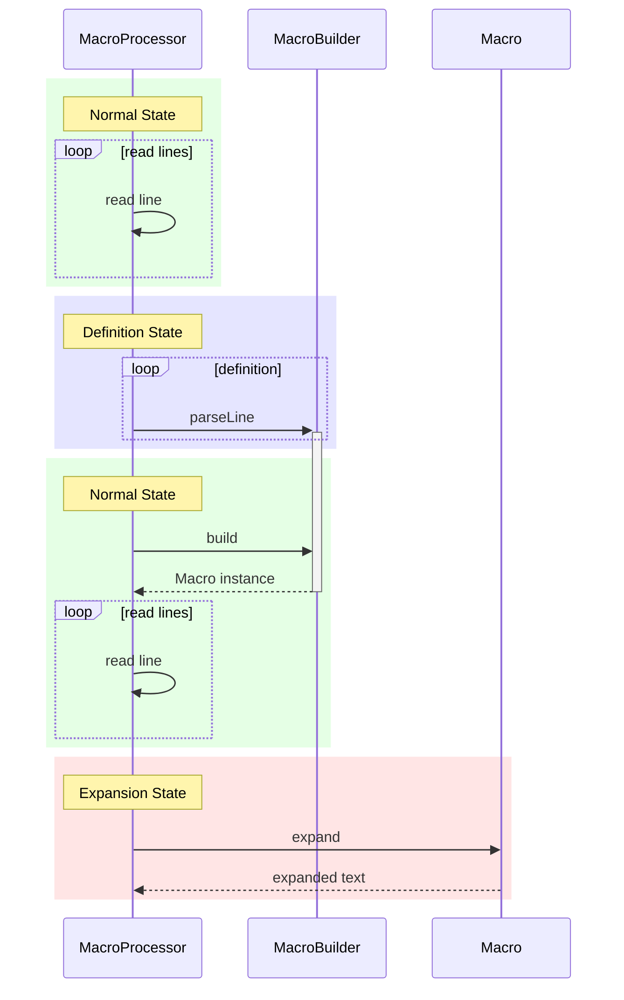

```mermaid
sequenceDiagram
	rect rgba(0, 255, 0, .1)
		note over MacroProcessor: Normal State

		loop read lines
			MacroProcessor->>MacroProcessor: read line
		end
	end

	rect rgba(0, 0, 255, .1)
		note over MacroProcessor: Definition State
		loop definition
			MacroProcessor->>+MacroBuilder: parseLine
		end
	end

	rect rgba(0, 255, 0, .1)
		note over MacroProcessor: Normal State
		MacroProcessor->>MacroBuilder: build
		MacroBuilder-->>-MacroProcessor: Macro instance

		loop read lines
			MacroProcessor->>MacroProcessor: read line
		end
	end

	rect rgba(255, 0, 0, .1)
		note over MacroProcessor: Expansion State
		MacroProcessor->>Macro: expand
		Macro-->>MacroProcessor: expanded text
	end
```